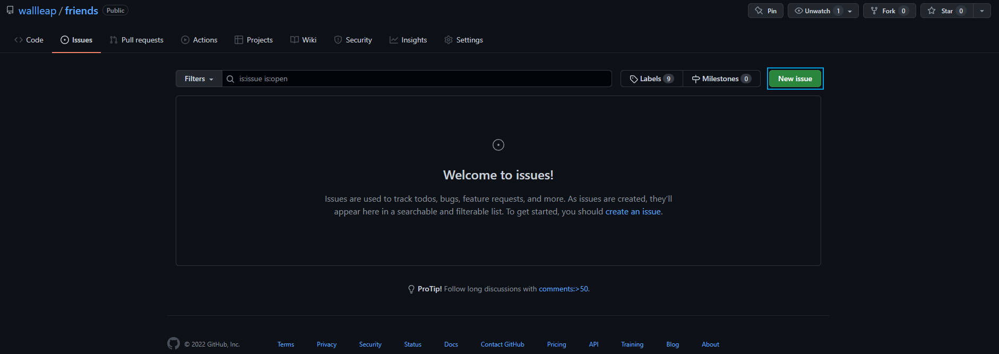
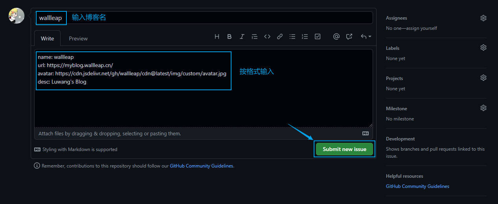
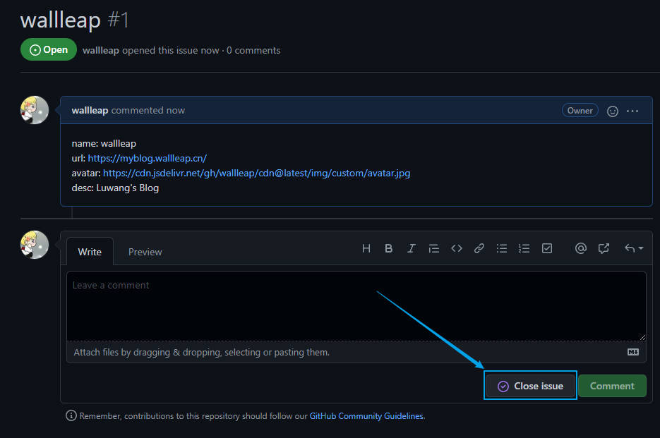

## 仓库说明

仓库不存储代码，通过提交 Issue 的方式添加友链（GitHub API）

## 提交友链

友链地址：[https://myblog.wallleap.cn/#/friend](https://myblog.wallleap.cn/#/friend)

可以在 Issues 页面创建 Issue 提交，格式为：

```json
name: 博客名称
url: 博客链接
avatar: 您的头像链接
desc: 博客描述
```

## 示例

点击本仓库的 [Issues](https://github.com/wallleap/friends/issues)，在该页面点击 `New issue` 按钮



在新的页面输入内容之后点击 `Submit new issue` 进行提交



提交之后点击 `Close issue` 即可


